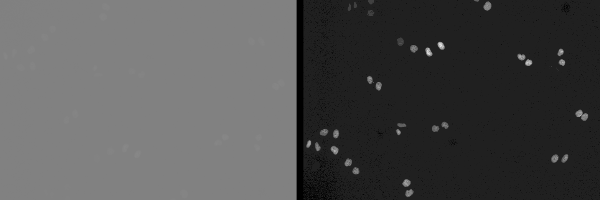
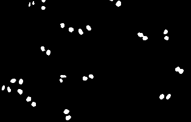
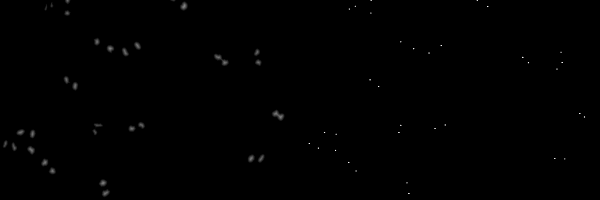
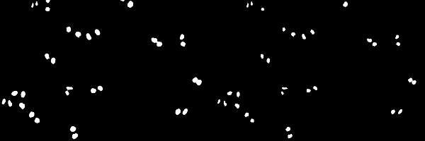
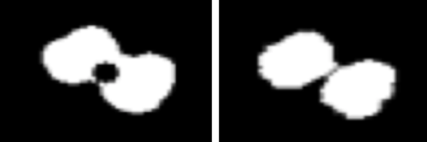
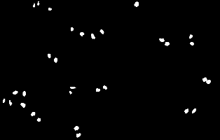
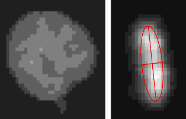
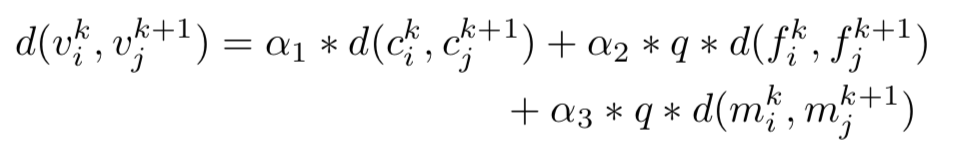

Tracking cancer cell is critical for cell cycle and dynamics analysis; however, the great variety of cells' apperence through time and during mitosis bring lots of challenges for this task. This blog post an algorithm based on [Li's work](https://www.ncbi.nlm.nih.gov/pubmed/19643704) using watershed for segmentation and dissimilarity measurement including neighboring distribution, nuclei morphological appearance, migration, and intensity information for tracking. 

---
## Final Result 


## Dataset 
The data from this blog comes from HeLa cells stably expressing H2b-GFP (2D) in [Cell Tracking Challenge](http://www.codesolorzano.com/Challenges/CTC/Welcome.html)

## Workflow  
1. Data preprocessing  
2. Segmentation using watershed  
	Binarization  
	Distance map   
	Watershed   
3. Tracking    
	Neighboring Graph Construction   
	Contour Analysis  
	Histogram      
	Position   
	Mitosis   
	Matching  

## Data Reading and Preprocessing
Since the original data is unnormalized, we use OpenCV function: [cv2.normalize](https://docs.opencv.org/2.4/modules/core/doc/operations_on_arrays.html#normalize) to normalize images:
```python
cv2.normalize(image, normalized_image, 0, 255, cv2.NORM_MINMAX)
```    
The result is like this (left: original iamge; right: image after normalization):


## Segmentation
In order to track cells, we need to do segmentation first. In this method, we use [seeded-watershed](https://en.wikipedia.org/wiki/Watershed_(image_processing)) algorithm for cell segmentation. 

### Binarization
In order to get a rough binary image with cell-classified pixel as foreground, we implement simple thresholding with empirical threshold value for coarse segmentation and morphological closing for hole filling.
```python
img = cv2.GaussianBlur(img,(5,5),0).astype(np.uint8)
_, thresh = cv2.threshold(img, threshold, 1, cv2.THRESH_BINARY) # threshold = 50

kernel = cv2.getStructuringElement(cv2.MORPH_ELLIPSE,(9,9))
thresh = cv2.morphologyEx(thresh, cv2.MORPH_CLOSE, kernel)
```
The result of binarization:  


### Distance Map 
To do watershed, we need to find the seed point for each cell first, which is the center of cells. To detect these points, a simple way it to compute L2 distance map and maximum filter to extract the centers.
```python
cv2.distanceTransform(image, distanceType=2, maskSize=0) # using L2 distance and use the percise mask
scipy.ndimage.filters.maximum_filter(image, neighborhood_size) # empirically set neighborhood_size to 20 (the min distance to the nearest cell)
```
The result is like this (left: distance map; right: seeds for watershed):



### Watershed 
Finally, it's time to use watershed based on the seed points to segment cells!
```python
_, labels = cv2.connectedComponents(seed_img) # use region growing label each seed
segmentation = cv2.watershed(combined_img, labels) # watershed
```
**Note:** the input image to watershed is not the normalized image, but the image combine with distance map with certain coefficient; in another word, 
```
I_combined = I_normalized + a * I_distance
```
where **a** is set empirically as 0.4. 

The result is like this (left: result of binarization; right: result of watershed):



Watershed can segment the cells overlapping together (left: result of binarization; right: result of watershed):  


## Tracking
In this step, we implement the tracking algorithm based on the watershed results and normalized images.

### Neighboring Graph Construction
The similarity of cell's morphology makes it hard to track; therefore, understanding the spatial relationship with repect to each cell is significant to us, like the number of neighbours and the directions of those neighbours. In this method, we use [Delaunay triangulation](https://en.wikipedia.org/wiki/Delaunay_triangulation) to build this kind of Neighboring Graph. OpenCV provides a **cv2.Subdiv2D** function for triangulation.

To implement triangulation, firstly, we need build the **Subdiv2D** instance:
```python
# Rectangle to be used with Subdiv2D
h, w = image.shape[:2]
rect = (0, 0, h, w)
 
# Create an instance of Subdiv2D
subdiv = cv2.Subdiv2D(rect)
```

Afterwards, we need to find the center points for each cell and in our case, we compute the centroid for each cell region. 
```python
_, contours, _ = cv2.findContours(watershed, cv2.RETR_EXTERNAL, cv2.CHAIN_APPROX_TC89_KCOS) # find contours 
for contour in contours:
	m = cv2.moments(contour)
	if m['m00']:
	    centroids.append(( int(round(m['m01']/m['m00'])),\
	                       int(round(m['m10']/m['m00'])) ))
```

Lastly, we triangulate these points by:
```python
for pt in centroids:
	subdiv.insert(pt)
	triangleList = subdiv.getTriangleList();
	for tri in triangleList:
		# pt1, pt2, pt3 are the three vertices of each triangular
		pt1 = (int(t[0]), int(t[1])) 
		pt2 = (int(t[2]), int(t[3]))
		pt3 = (int(t[4]), int(t[5]))
```

Result of triangulation:  



### Contour Analysis
To measure the distance of contours between cells, directly using its binary shape is a way, but in this method, we use [Fourier Descriptors (FDs)](http://demonstrations.wolfram.com/FourierDescriptors/), instead, since reduce the sensitivity of using binary boundary by using the lower order of the descriptor. **[pyefd](https://pypi.python.org/pypi/pyefd/)** package provides the function for computing FDs. 

We can get the parameters of FDs by:
```python
_, contours, _ = cv2.findContours(watershed, cv2.RETR_EXTERNAL, cv2.CHAIN_APPROX_TC89_KCOS)
for contour in contours: 
	pyefd.elliptic_fourier_descriptors(contour, order=10, normalize=False) # we empirically choose the order as 10
``` 

### Intensity Analysis
For intensity analysis, we use [Co-occurrence Matrix (CM)](https://en.wikipedia.org/wiki/Co-occurrence_matrix) to measure the texture of cells, since unlike simple histogram, CM not only provides the information of intensity amongst all pixels, but also includes the spatial feature, such as texture. In our case, we use 4-direction CM to build the texture feature. The implementation of this part is pretty straightforward and it's little bit long; therefore, I'll only describe some patches and for more details, please go to the [Github repository](https://github.com/Connor323/Cancer-Cell-Tracking) and look into the **ipynb** code. 

```python
# convert the intensity from 0 - 255 to 0 - level (we set it as 10)
max_v, min_v = np.max(cell_patch_in_normalized_image), np.min(cell_patch_in_normalized_image)
range_p = max_v - min_v
img = np.round((cell_patch_in_normalized_image.astype(np.float32)-min_v)/range_p*level)

# initialize CMs
h, w = img.shape[:2]
p_0 = np.zeros((level,level))
p_45 = np.zeros((level,level))
p_90 = np.zeros((level,level))
p_135 = np.zeros((level,level))

... # scan each pixel in the patch of a single cell to build CMs
	
... # compute the Entropy, Energy, Contrast, Homogeneity for each CM	
```

### Position
We describe the position of cells simply using centroids. 

### Mitosis Analysis
Since the cells in mitosis has unusually appearance in terms of intensity and boundary, we need to identify them when we compute the distance of disimilarity. To identify the cell in mitosis, the simple way it to identify the elongated cells, since that's how they usually look like. To identify elongated shape, we use the ratio of major axis and minor axis of the eclipse of inertia for each cell. 
```python
_, contours, _ = cv2.findContours(cell_patch_in_binary, cv2.RETR_EXTERNAL, cv2.CHAIN_APPROX_TC89_KCOS)
(x,y),(minor,major),angle = cv2.fitEllipse(contours[0])
ratio = major / minor
```

The example of the cell in mitosis is shown below (left: the cell in previous frame; right: the same cell in mitosis):



### Matching
Finally, we have all of the features we need and then we can use these features to match (track) cells based of the disimilarity metrics: 

where the meanings of each term in the right hand side are the distance of centroid, the difference of FDs and the difference of CMs. For more details, please look into the [technical report](https://github.com/Connor323/Cancer-Cell-Tracking/blob/master/report/cell_tracking_final.pdf) in the Github repository.

The final result:


The example of tracking the cell in mitosis. 


The plot of the previous tracking. 


### **Done!**
